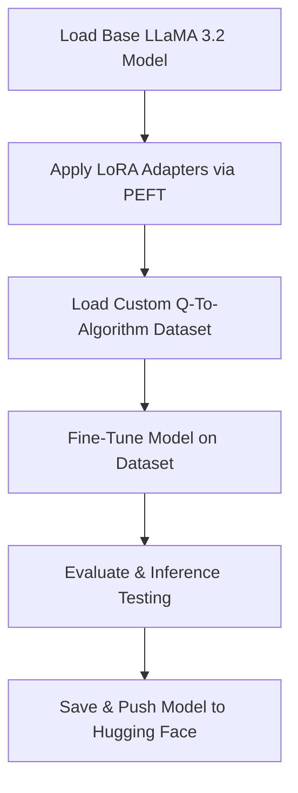

# Algorithm Generator Using LLM Fine-Tuning (LoRA + PEFT)

## 📖 Project Overview

This project demonstrates fine-tuning and deploying a large language model (LLM) using PEFT (Parameter-Efficient Fine-Tuning) techniques like LoRA. The model generates structured, step-by-step algorithm descriptions from natural language queries.

**Goal:** Make algorithm writing accessible by enabling structured algorithm generation from plain English prompts using a fine-tuned LLaMA 3.2 model.

**Objective:** This project is specifically designed for students who are new to coding. Instead of providing direct code outputs, it offers structured algorithm steps. This approach helps students understand and practice coding logic, rather than simply copying solutions. The system aims to serve as an educational tool in computer science college labs, offering an interface similar to code editors.

---

## ✅ Key Highlights

* Fine-tuned `LLaMA 3.2 3B` model using LoRA and PEFT.
* 4-bit bnb quantization for resource-efficient training and inference.
* Custom dataset featuring natural language questions paired with algorithmic solutions.
* Model exported and shared via Hugging Face Hub in standard and GGUF formats.

---

## 🚀 Technologies & Tools Used

* Python 3.11
* Unsloth Library
* Hugging Face Transformers & Datasets
* LoRA (Low-Rank Adaptation)
* PEFT (Parameter Efficient Fine-Tuning)
* bnb 4-bit Quantization
* CUDA + Torch (GPU Enabled)

---

## ⚙️ System Architecture



---

## 📊 Dataset Details

* **Dataset Name:** my\_q\_algo (Hugging Face)
* **Format:** JSON / Hugging Face Dataset
* **Fields:**

  * `conversations`: Prompt-response pairs formatted using Unsloth chat templates.

---

## 📂 Project Files

* `project_q_to_algo.py`: Main script for fine-tuning, inference, and deployment.
* `lora_model/`: Directory containing saved LoRA adapters.

---

## 💻 How to Run

1. Install dependencies:

```bash
pip install unsloth transformers datasets trl accelerate bitsandbytes
```

2. Execute the fine-tuning and inference script:

```bash
python project_q_to_algo.py
```

3. Example Interaction:

```
User: Write the algorithm for linear search.
Assistant:
Step 1: Start.
Step 2: Take array and element to search.
Step 3: Traverse array elements one by one.
...
```

---


---

## 🏷️ Tags

`LLM Fine-Tuning` `Python` `LoRA` `PEFT` `Algorithm Generation` `Custom Dataset` `Hugging Face` `Unsloth`

---


---


---

> **Note:** This project requires GPU resources. It is recommended to use hardware with at least 16–24 GB of VRAM for optimal performance.
